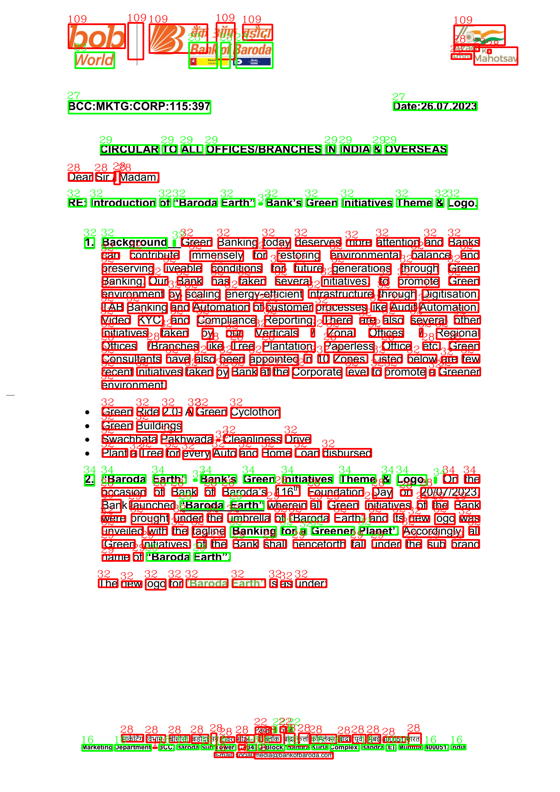

# Layout Parser - Font Attributes 

## Description

An endpoint to return the font attributes (font size, font color, font decoration) has been integrated to the code.

## API Endpoint and usage

Created a module server/modules/preprocess to have the endpoint for font attributes

font endpoint - /layout/preprocess/font_v2

inputs: list of images

task: visualisation/font attribute

model: doctr/tesseract

k_size: kernel size for detecting bold text (automatic for tesseract) (bigger font requires higher value)

bold_threshold: sensitivity for bold detection. (lower value means more sensitive)

Note: Default parameters work for most cases.

### Example

## Modifications

### Code

Main additions in server/modules/preprocessv2

In app.py line 10 imported router from preprocessv2, which was imported from preprocess folder.

### Requirements

Only added the following libraries

- beautifulsoup4
- scikit-learn
- pytesseract

Install tesseract-ocr in local system as well using following steps:
- download tesseract-ocr in ubuntu
  * sudo apt install tesseract-ocr
  * sudo apt install libtesseract-dev
- set path in helper.py line 26 (for ubuntu only)
  * pytesseract.pytesseract.tesseract_cmd = r"/usr/bin/tesseract"

## Suggestions

The deleting of the images existing in image directory is OS dependent in the original code. 

server/modules/preprocessv2/helper.py has a simple function that can be used to delete files in the directory

## Queries

As far as I can observe, the exisiting server/modules/preprocess seems to be a placeholder that needs implementation. None of the endpoints in the module work.
