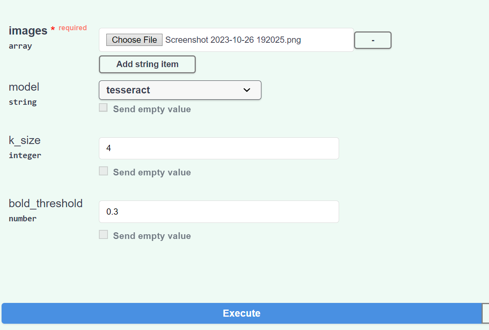
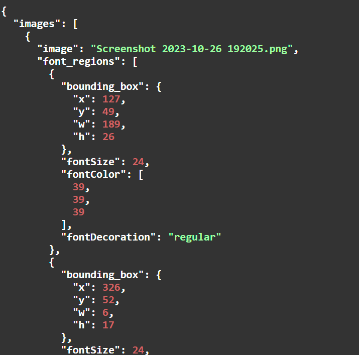

# Layout Parser - Font Attributes 

## Description

An endpoint to return the font attributes (font size, font color, font decoration) has been integrated to the code.

## API Endpoint and usage

Created a module server/modules/iitb_font to have the endpoint for font attributes

font endpoint - /layout/iitb-font/font

inputs: list of images

model: doctr/tesseract

k_size: kernel size for detecting bold text (automatic for tesseract) (bigger font requires higher value)

bold_threshold: sensitivity for bold detection. (lower value means more sensitive)

Note: Default parameters work for most cases.

### Example

## Modifications

### Code

Main additions in server/modules/iitb_font

The code that does the font attribute detection is present in server/models/text_attributes.py

Added the created router in app.py line 35

### Requirements

Only added the following libraries

- beautifulsoup4
- scikit-learn
- pytesseract

## Suggestions

The deleting of the images existing in image directory is OS dependent in the original code. 

server/modules/iitb_font/helper.py has a simple function that can be used to delete files in the directory

## Queries

As far as I can observe, the exisiting server/modules/preprocess seems to be a placeholder that needs implementation. None of the endpoints in the module work.